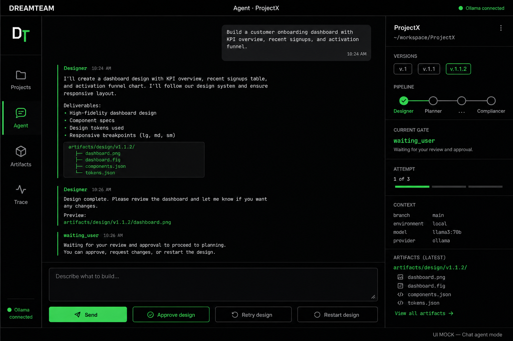

# DreamTeam — Local Install Guide (macOS)

Install and run DreamTeam locally: **one Podman container** for the app, **Ollama on the host Mac**.

## What you need

- macOS (Apple Silicon recommended)
- Git and Node.js (use a current LTS; Node 22 matches the project)
- [Podman](https://podman-desktop.io/) (Podman Desktop, or CLI with a started machine)
- [Ollama](https://ollama.com/download) for macOS

## 1. Install and prepare Ollama (host)

1. Install Ollama from the official site and open the app.
2. Pull the default model used by DreamTeam:

   ```bash
   ollama pull llama3.2
   ```

3. Confirm the API is up (Ollama’s local API endpoint — see Ollama docs / app status):

   ```bash
   curl -s "$OLLAMA_URL/api/tags"
   ```

   Or, if you have not set aliases yet, use Ollama’s default local URL from the app docs.

4. In **Ollama → Settings**:
   - leave **Expose Ollama to the network** **Off** (local use only)
   - **Cloud** can stay Off for a fully local setup
   - raise **Context length** only if you need longer prompts (uses more RAM)

Models are stored under the path shown in **Ollama → Settings → Model location**.

## 2. Clone the project and start with Podman

```bash
git clone https://github.com/muskmr/dreamteam-agedevs.git
cd dreamteam-agedevs
git checkout main
npm run podman:up
```

`npm run podman:up` (`scripts/podman-up.sh`):

- detects macOS / arch
- checks Podman; if missing, prints install steps (Problem / Solution / Commands)
- builds the image from `Containerfile`
- runs one container (API + web) and points it at **host Ollama** via the container→host DNS name configured in the script
- prints the **Web URL** to open in the browser

Ports and bind addresses are controlled by environment variables when you start the stack (see the script / [`docs/DEPLOY-PODMAN.md`](DEPLOY-PODMAN.md)): typically overrides for the web UI, API, and Ollama service if the defaults are busy.

Stop the stack:

```bash
npm run podman:down
```

## 3. First-run smoke check

1. Open the Web URL printed by `podman:up`.
2. Confirm the UI shows **Ollama connected** (if not, use the status chip hints: serve / pull model).
3. Create a project → send a short prompt → wait for the Designer.
4. Click **Approve design** once; do not re-click while the pipeline runs.
5. Review **Artifacts** and **Trace**.

## Troubleshooting

| Problem | What to do |
|---------|------------|
| Podman not ready | Start Podman Desktop, or start the Podman machine from the CLI |
| Ollama disconnected in UI | Ensure the Ollama app is running; pull `llama3.2`; check Ollama settings (network expose Off for local-only) |
| Port already in use | Re-run `podman:up` with the port override env vars documented in the deploy script / [`docs/DEPLOY-PODMAN.md`](DEPLOY-PODMAN.md) |
| UI looks stuck after Approve | Wait; avoid Retry/Restart/Send while a run is in flight |

## Optional: bare-metal Node (no Podman)

```bash
npm install
source env/aliases.sh
npm run dev
```

`env/aliases.sh` sets the local service URL variables used by the app. Keep Ollama running on the host as in step 1.

## UI (agent mode)



The DreamTeam agent workspace: **Projects** / **Agent** / **Artifacts** / **Trace**, chat with Designer, and **Approve** / **Retry** / **Restart** design when waiting for review. Ollama connection status appears in the UI.
